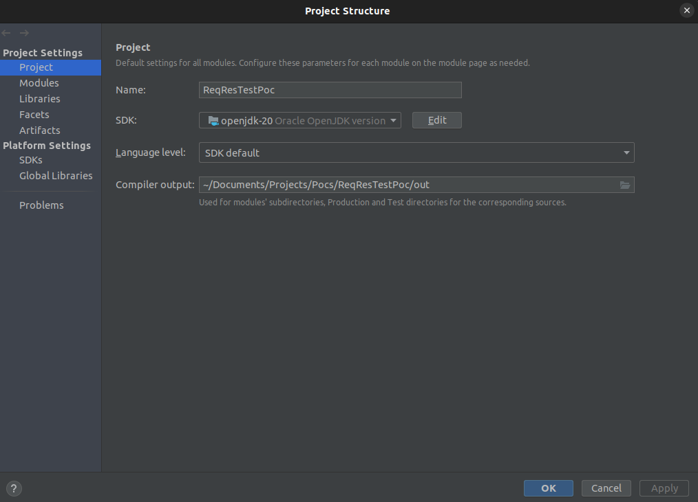
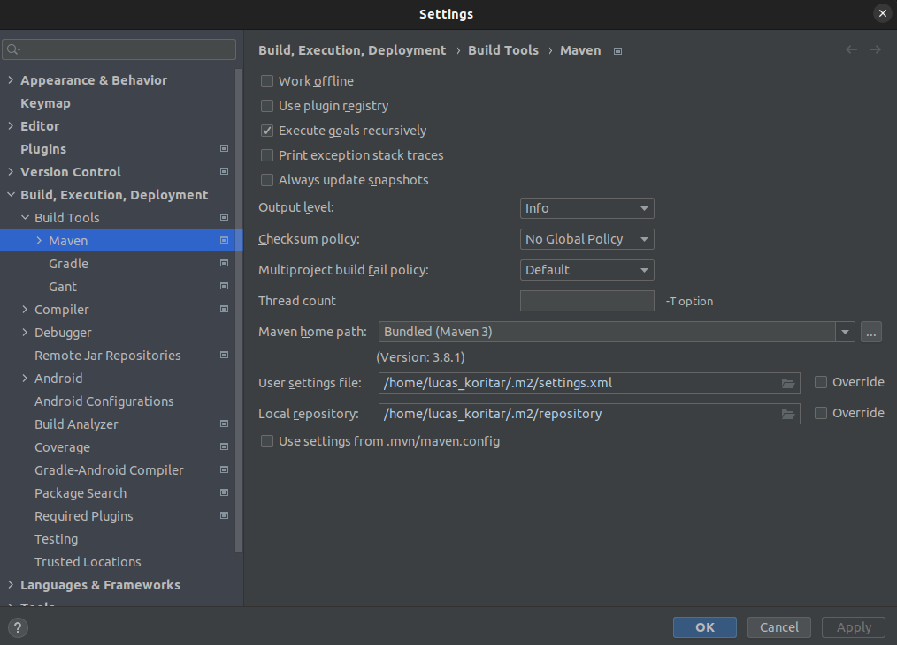
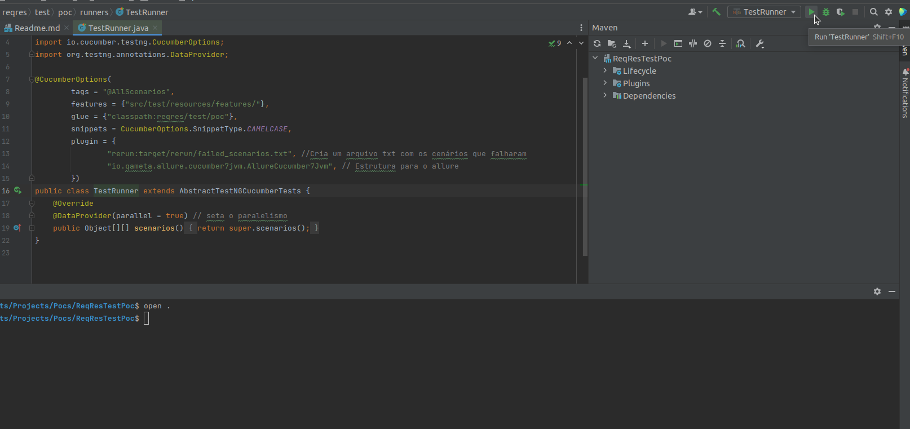
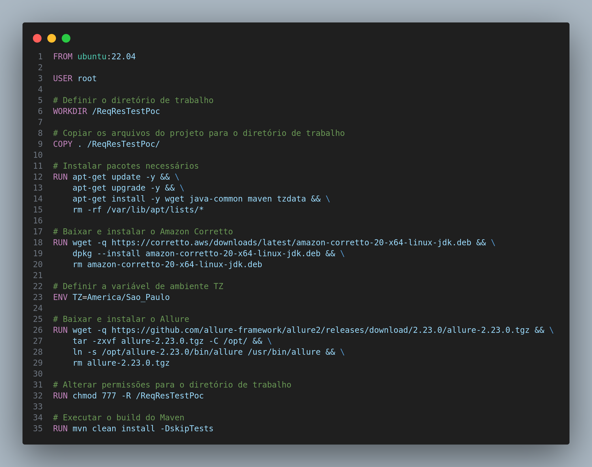
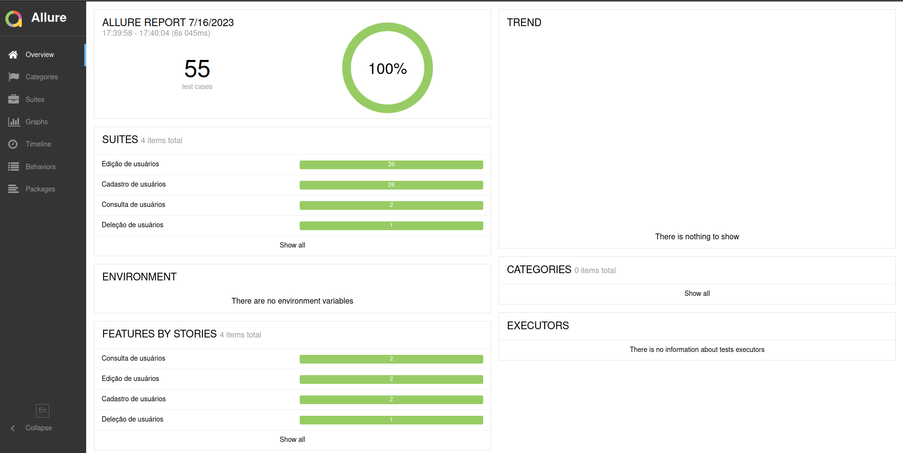

# ReqResTestPoc

O ReqResTestPoc é um projeto de exemplo que utiliza Java, Maven, RestAssured, Allure, TestNG, Cucumber e Faker para automação
de testes de API.

## Descrição do Projeto

Este projeto é uma demonstração de automação de testes de API utilizando tecnologias populares do ecossistema Java. O
objetivo é mostrar como realizar testes de API de forma automatizada, integrando várias ferramentas populares.

## Recursos e Tecnologias Utilizadas

- Java: Linguagem de programação utilizada para desenvolver a automação de testes.
- Maven: Ferramenta de automação de construção e gerenciamento de projetos Java.
- RestAssured: Framework Java para testar e validar APIs RESTful.
- Allure: Ferramenta para geração de relatórios interativos de testes.
- TestNG: Framework de testes utilizado para executar os testes de forma estruturada.
- Cucumber: Ferramenta de escrita de cenários de teste em linguagem natural.
- Faker: Biblioteca Java para geração de dados de teste aleatórios.

## Pré-requisitos

Certifique-se de ter os seguintes pré-requisitos instalados em seu ambiente de desenvolvimento:

- Java JDK 17 ou superior
- Maven
- IDE (IntelliJ)

## Como Executar?

- Localmente via IDE
- Docker

<strong>Localmente via IDE</strong>

Para executar o projeto localmente eu utilizei o IntelliJ com o JDK 20 e o Maven integrado.

- Open JDK:

- Maven:

A execução é realizada via TestRunner:

- Runner:

<strong>Docker</strong>

Para executar no Docker criei um Dockerfile que possui o ubuntu como SO com todas as dependencias necessárias:

Para executar o projeto usando o docker será necessário executar os seguites passos:

1. **Passo 1: Docker.**

    - 1.1 Possuir o Docker instalado.
    - 1.2 Docker precisa estar em execução.

2. **Passo 2: Projeto.**

   - 2.1 Abra um terminal na pasta do projeto.

3. **Passo 3: Comandos.**

   - 3.1 Execute o comando `docker build -t reqrestestpoc .`.
   - 3.2 Ao finalizar o build da imagem execute o comando: `docker images` e encontre o id da imagem.
   - 3.3 Execute o seguinte comando `docker run -it --rm -p 8080:8080 idDaSuaImagemAqui bash`.

4. **Passo 4: Execução dos testes**

    - 4.1 Caso queira executar o regressivo, execute o comando: `mvn test`.
    - 4.2 Caso queria executar uma tag específica: `mvn test -Dcucumber.filter.tags=@cadastrarUsuario`.

## Allure Reports
Certifique-se que a porta 8080 não esteja sendo utilizada por outra aplicação. Caso a porta esteja sendo utlizada, basta incluir outra porta ou remover a instrução `-p 8080` do comando.

Independente da forma escolhida de execução, seja dockerizada ou usando a IDE intelliJ para abrir o report do allure basta executar o seguinte comando: `allure serve reports/allure-results -p 8080`.

